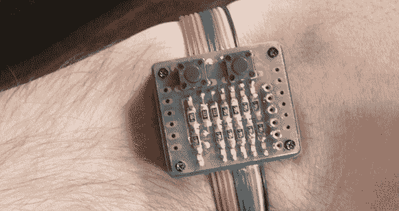

# 自制二元手表

> 原文：<https://hackaday.com/2013/03/24/a-homebrew-binary-wristwatch/>

世界上有两种人:懂二进制的，不懂的，懂三元的。[伊曼纽]认为二元手表是书呆子的巅峰之作，于是[着手打造自己的](http://forgeofstuff.blogspot.it/2013/03/binary-clock.html)。由此产生的二进制时钟不仅像预期的那样让书呆子尖叫，而且还是一个功能性的时间片。

当[伊曼纽]在学校研究图片时，他萌生了制作二元手表的想法。为了不浪费这些知识，他使用了 PIC16F628 微控制器。有四个 led 用于显示小时，六个 led 用于显示分钟，每个 led 都连接到一个单独的微控制器引脚，便于编程。

为了保持时间，[伊曼纽]让 PIC 大部分时间处于睡眠模式，只有当内部定时器的寄存器溢出时才唤醒它。手表大部分时间都在睡眠中，从纽扣电池中吸取能量，电池寿命至少应该持续几周。

整个电路隐藏在一个 PVC 外壳中，带有一个奇妙的彩虹带状电缆带。我们不太确定这一整天贴在皮肤上的感觉如何，但它确实散发出了伊曼纽一直在寻找的书呆子气。