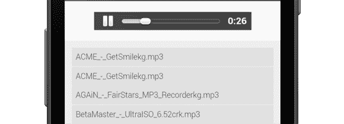
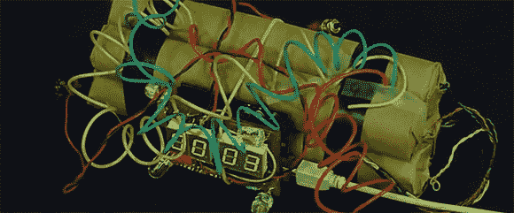

# 黑客日链接:2013 年 3 月 25 日

> 原文：<https://hackaday.com/2013/03/25/hackaday-links-march-25-2013/>

#### 非法，但令人印象深刻

要苏打水吗？随便找一个机器人，把它塞进自动售货机，然后给自己找一个。这个视频是难以置信的法国，但看起来我们有一个用旧打印机和其他各种电机和齿轮定制的机器人。当你考虑到 16 盎司的易拉罐重 1 磅时，这确实令人印象深刻。

#### UNOBTANIUM

好吧，我们的举报热线收到了很多邮件。这是 Tindie 上一个可编程振荡器的团购。为什么这很酷？这款芯片(an SI570)用于许多软件定义无线电设计。此外，如果你不是一次订购数千个，那么很难买到。[这里有一个数据表](https://www.silabs.com/Support%20Documents/TechnicalDocs/si570.pdf)，现在给我们看看这个振荡器的一些构建。

#### Chiptune/keygen 音乐随处可见

[Huan]有一个合作的 Raspi，想要一个可以在任何地方、任何设备上使用的媒体服务器。他想出的是一项服务，从你最喜欢的 keygens 播放 chiptune 音乐。你可以用 Chrome 访问它(不，我们没有直接链接到 Raspberry Pi)，它非常高效——他的 RAM 使用没有增加一点。

#### 带上飞机。或者邮寄。

[Alex]的 hackerspace 刚刚举办了一系列闪电讲座，那些有 45 分钟长演讲的人试图将他们的演讲浓缩到 10 分钟。当然，黑客空间需要某种方式来保持一切按计划进行。一个简单的倒计时器太无聊了，所以他们用了一个假的好莱坞式的炸弹。不，不爆炸，但是看起来还是真的真的假的。这是件好事。

#### 打印机现在有扬声器了？

[ddrboxman]认为他的 reprap 需要一个漂亮的“打印完成”通知。在他的电子板上加了一个压电元件后，他迅速编写了一个固件程序，可以播放那些古老的诺基亚铃声。铃声通过 Gcode 播放，因此可以发出声音警告和通知。如果它会玩蛇就好了。