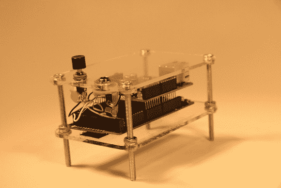

# 使用 Moshi Moshi 接听电话

> 原文：<https://hackaday.com/2013/03/26/get-phone-calls-answered-with-the-moshi-moshi/>

有一个不擅长打电话的另一半？[Aaron]很难联系到他的妻子，所以他想出了一个解决方案。[魔石魔石](http://aaron-sherwood.com/blog/?p=712 "Moshi Moshi")检测到来自【亚伦】的电话，并播放音乐来引起她的注意。

运行 Asterisk 的远程服务器接收呼叫，并使用 Ruby 脚本记录呼叫。每隔十秒钟，一个带有以太网屏蔽的 Arduino Due 就会轮询一次 Sinatra 网络服务器，看看是否有电话打来。如果有新的电话打进来，就会播放音乐循环。获得由于循环音频有点挑战，但最终结果听起来不错。

相当多的技术汇集在一起，使魔石魔石，所有的代码都提供了书面。这对任何想把硬件和星号 PBX 结合起来的人都有帮助。休息之后，[Aaron]向我们展示了这个系统是如何工作的。

[//player.vimeo.com/video/61599859](//player.vimeo.com/video/61599859)