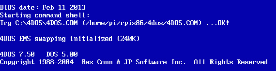

# 树莓派:旧 DOS 游戏的完美机器

> 原文：<https://hackaday.com/2013/03/26/raspberry-pi-the-perfect-machine-for-old-dos-games/>

有一个为 DOS 开发的优秀而古老的游戏宝库，这些游戏在现代电脑上几乎无法玩。像 Lucasarts SCUMM adventures，the original Civilization and SimCity，Starflight，the King's Quest series，甚至休闲套装 Larry 这样的精彩游戏现在都不怎么玩了，因为要让它们在现代硬件上运行或设置一个具有适当声音的模拟器几乎是不可能的。

[Patrick]一直在尽最大努力帮助经典游戏玩家，为 Raspberry Pi 开发 x86 模拟器。它被设计成一个非常强大的 DOS 盒，具有 20 MB 的扩展内存、256 色的 640×480 显示器、大约 20MHz 的 486 模拟 CPU 和 Soundblaster 2.0 声卡。

还有很多工作要做，但除了找到一台 20 年前的电脑，在树莓派上进行仿真，这可能是你能得到的最真实的 DOS 游戏体验。