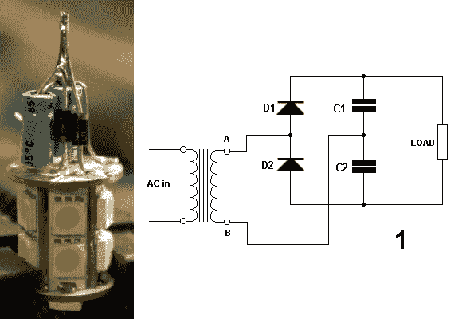

# 让 12V 的灯泡在 6V 的插座中工作

> 原文：<https://hackaday.com/2013/03/27/making-a-12v-bulb-work-in-a-6v-socket/>

这是一个方钉在圆孔上的问题。[基尔·莱德斯塔德]一直骑着一辆老式轻便摩托车到处跑。你知道，可以像自行车一样蹬的摩托车。他当然想让这个东西看起来有库存，但也需要它功能齐全。进入这个灯泡更换项目。他的刹车灯需要一个新灯泡，他设法让这个 12V 的 LED 灯泡在 6V 的插座中工作。

LED 是这种应用的绝佳选择，因为[motobécane 助力车](http://en.wikipedia.org/wiki/Motob%C3%A9cane#Mopeds)使用磁发电机为灯供电。它不会拉太多电流，但它确实需要修改，以运行一半的电压。[Kiel]提到，也许有可能打开 LED 塔并调整内部的限流电路，但他认为只添加这个倍压电路会更容易。他组装这些部件的方式仍然允许它们安装在灯泡的金属底座中。