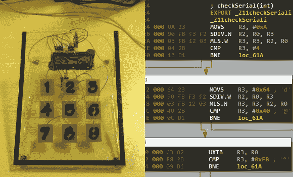

# 逆向工程挑战从简单开始

> 原文：<https://hackaday.com/2013/03/28/reverse-engineering-challenge-starts-off-simple/>

我们喜欢看到核心固件逆向工程项目，但是能够完成这些项目的黑客数量相对较少。不过，黑客精英的队伍是有可能壮大的。黑客空间是一个像这样进行小挑战的好地方。[Nicolas Oberli]设计了一个捕捉旗帜游戏，要求参赛者对 Teensy 3.0 固件进行逆向工程。

他为 Insomni'hack 2013 活动开发了这个硬件。它使用 Teensy 3.0 电容触摸功能，形成一个九位数的键盘，带有一个字符液晶屏，用于反馈。当输入正确的代码时，屏幕将显示如何检索“标志”的说明。

在右侧，您可以看到的拆卸。Arduino IDE 生成的 elf 文件。这就是[Nicolas]给参赛者的东西，它让他们越过了计算如何从芯片本身转储代码的障碍。但它确实让他们在汇编中思考，并最终导致找出该设备的密码是什么。这可能只是朝着正确的方向推了一把，人们需要把深入挖掘嵌入式硬件作为一种爱好。

[https://www.youtube.com/embed/VOQBLBCgZtU?version=3&rel=1&showsearch=0&showinfo=1&iv_load_policy=1&fs=1&hl=en-US&autohide=2&wmode=transparent](https://www.youtube.com/embed/VOQBLBCgZtU?version=3&rel=1&showsearch=0&showinfo=1&iv_load_policy=1&fs=1&hl=en-US&autohide=2&wmode=transparent)