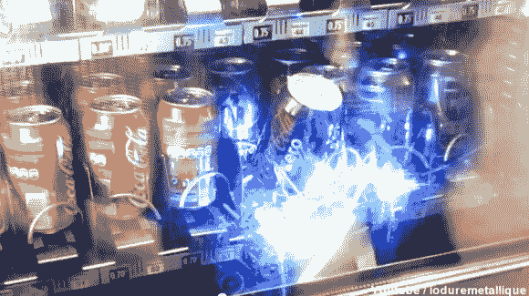

# 机器人从自动售货机里偷汽水

> 原文：<https://hackaday.com/2013/03/27/robot-steals-soda-from-the-vending-machine/>

由于超级明亮的蓝色发光二极管，很难从这张照片中分辨出来，但[这台汽水机正在被一个机器人](https://www.youtube.com/watch?v=TLXXLY7zewo)抢劫。

我们不宽恕偷窃，但项目的创建者也不宽恕。【Ioduremetallique】真的只是解题；做一些事情因为他可以。我们敢打赌，这种事情最终会让他有一天找到一份高薪工作(我们假设他目前在上学)。

休息后，视频中展示了该项目。它的要点是一个紧凑的机器人手臂被放入自动售货机的投放区。翻盖关闭后，有线遥控器用于提升伸缩臂，并用夹子夹住汽水罐。它既聪明又狡猾。整段视频都是法语的，但是 YouTube 字幕翻译器实际上对这段视频处理得很好。要打开它，请使用视频底部的“抄送”图标。我们必须先选择法语字幕，然后才能从翻译字幕列表中选择英语字幕。大约四分钟后，我们看到了硬件本身…一个超级黑客！

[https://www.youtube.com/embed/TLXXLY7zewo?version=3&rel=1&showsearch=0&showinfo=1&iv_load_policy=1&fs=1&hl=en-US&autohide=2&wmode=transparent](https://www.youtube.com/embed/TLXXLY7zewo?version=3&rel=1&showsearch=0&showinfo=1&iv_load_policy=1&fs=1&hl=en-US&autohide=2&wmode=transparent)

[谢谢威廉]