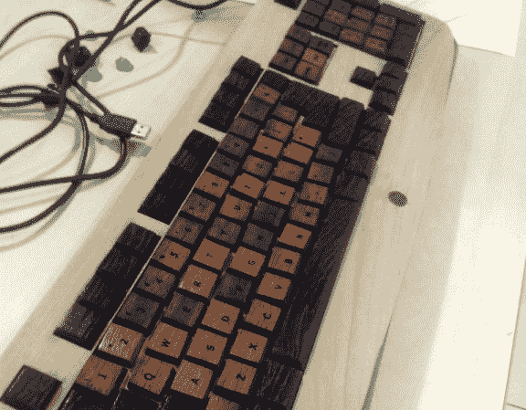

# USB 键盘的木质齿

> 原文：<https://hackaday.com/2013/03/29/wooden-teeth-for-your-usb-keyboard/>

我们刚刚第一次得到了一个符合人体工程学的键盘，非常喜欢它。但是这个键盘黑客的样子让我们开始怀疑自己。[威尔假装]为他的 USB 键盘完成了一个绝对令人惊叹的木制改造。请注意，他的项目日志包括 175 张照片，其中大多数都有说明文字。

他首先拆开原来的 USB 键盘，看看他在做什么。在挖掘有价值的木材之前，他用一些薄的中密度纤维板切割试件。但是一旦他有了完成项目的明确计划，事情就会顺利进行。

这些按键不是简单的 Chicklet 风格的覆盖层，它们具有你在低级塑料外设上所能找到的深度。这是通过铣削每个键，然后通过激光切割机将它们发送到顶部的每个字母来完成的。

花些时间完成整个项目(如果你感到沮丧，这里有一个缩略图布局)。不幸的是【威尔】说[他实际上并不使用键盘](http://www.reddit.com/r/DIY/comments/1b4grl/wooden_keyboard_build/c93i1lt)，因为颗粒卡住了，按键移动得太多了。但它确实有效。