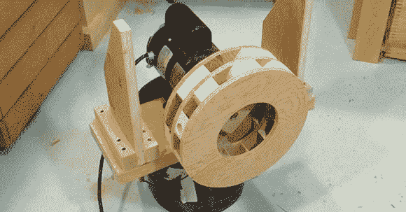

# 制作木制空袭警报

> 原文：<https://hackaday.com/2013/03/31/building-a-wooden-air-raid-siren/>

不久前，[马提亚斯]正在为他的商店设计吸尘器。作为木工大师，他决定用木头建造一个集尘系统。最后一切都解决了，但是在制造木制叶轮和鼓风机时，他发现他的作品制造了很多噪音。为了这个项目，他决定[以空袭警报的形式](http://woodgears.ca/siren/index.html)制造一个尽可能大的声音，而不是试图让他的鼓风机安静下来。

马蒂亚斯的空袭警报背后的基本思想是制造两个叶轮，迫使空气通过转子周围的两个定子。随着汽笛的旋转，来自叶轮的空气要么被阻挡，要么穿过定子，产生交替的高低压；更准确地说，它产生了一吨的噪音。将两个叶轮叠在一起，你就得到一个木制的双音空袭警报。

对于一个旋转非常快的东西，我们很惊讶马蒂亚斯在平衡他的警报器方面没有比他遇到更多的问题。不过，从他的教程中可以学到一些有用的技巧:平衡弹球上的所有东西似乎真的有助于构建。

至于警笛有多大，【马蒂亚斯】给不了我们一个分贝的音量。从休息后的视频中，我们可以告诉你它真的真的很吵。

谢谢[迪米塔]送来这个。[马提亚斯]，如果你自己把项目送进去也没关系。你有权说，“我太酷了！”

[https://www.youtube.com/embed/2Tr6hCZAVhI?version=3&rel=1&showsearch=0&showinfo=1&iv_load_policy=1&fs=1&hl=en-US&autohide=2&wmode=transparent](https://www.youtube.com/embed/2Tr6hCZAVhI?version=3&rel=1&showsearch=0&showinfo=1&iv_load_policy=1&fs=1&hl=en-US&autohide=2&wmode=transparent) [https://www.youtube.com/embed/XAfvOjdZpkg?version=3&rel=1&showsearch=0&showinfo=1&iv_load_policy=1&fs=1&hl=en-US&autohide=2&wmode=transparent](https://www.youtube.com/embed/XAfvOjdZpkg?version=3&rel=1&showsearch=0&showinfo=1&iv_load_policy=1&fs=1&hl=en-US&autohide=2&wmode=transparent)