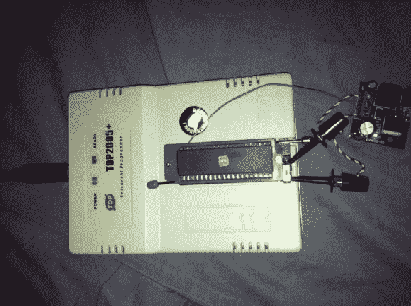

# 给 EPROM 编程器添加功能(应该已经有了)

> 原文：<https://hackaday.com/2013/03/31/add-features-that-should-have-already-been-there-to-an-eprom-programmer/>

[Morten Overgaard Hansen]有一个便宜的 EPROM 编程器，他用它来为复古游戏(以及其他游戏)编写芯片程序。他感到惊讶的是，尽管该设备包括一个 40 针 ZIF 插座，但它似乎缺乏对 16 位芯片编程的能力。他认为只要他稍加努力，就能让它打球。上面你可以看到[几个附加部件在设备上启用了 16 位编程](http://elgensrepairs.blogspot.dk/2012/05/extending-usage-of-top2005-universal.html)。

如果你看看机箱内部，你可能会惊讶地发现它使用了 FPGA。[Morten]四处搜索，并在网上找到了一些其他人，他们一直在寻求扩展这些类型的程序员的功能。具体来说，他遇到了一个 Python 程序，这个程序已经实现了为更大的芯片编程所必需的功能。他在编写自己的编程应用程序时将它作为指南。

在硬件方面，他需要给 VCC 引脚提供更高的电压，这是通过右边的升压转换器实现的。他还添加了一些跳线来管理输出使能信号。为了使整个事情模块化，他订购了一个带有长插脚的 ZIF 插座，并焊接在适当的位置。仔细看，你会发现 ZIF 插座有两个拉杆。右边的是原装插座，左边的是转接头。