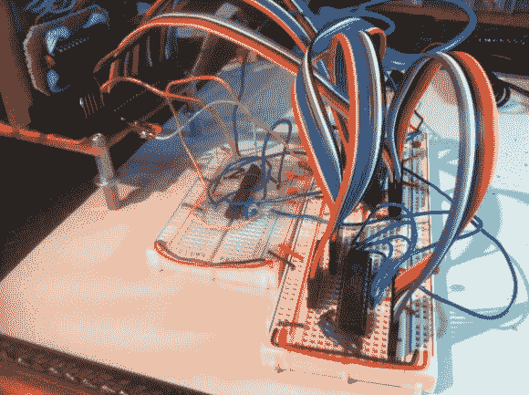

# 将 RAM 构建到 Veronica–6502 计算机中

> 原文：<https://hackaday.com/2013/03/31/building-ram-into-veronica-the-6502-computer/>

看起来很奇怪的是，RAM 在制作的这么晚的时候才被添加到计算机中，但是[奎因·邓基]一定一直都有这个想法，因为这是一个相当痛苦的经历。对于那些保持分数的人，这使得她的维罗妮卡项目[图灵完成](http://en.wikipedia.org/wiki/Turing_completeness)。

上图中颜色鲜艳的老鼠窝将新组件连接到左上角的 6502 计算机底板上。[Quinn]决定采用两个 32K SRAM 模块，这种模块需要的驱动硬件很少(挂在左边的试验板上)。RAM 模块将简单地监听其地址并相应地做出反应。两相时钟存在一个问题，即在第一个阶段需要保护 RAM 免受错误数据的影响。

让这一切工作实际上指出了她很久以前完成的 ROM 模块中的一个错误。在发现问题后，她能够简单地通过切割走线和焊接跳线来纠正问题。