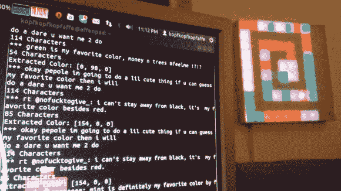

# 用 LED 矩阵可视化 Twitter

> 原文：<https://hackaday.com/2013/03/31/visualize-twitter-with-an-led-matrix/>

你最喜欢什么颜色？不要告诉我们，把它发到[Sebastian]最喜欢的彩色 Twitter 显示屏上，你就可以为挂在他墙上的艺术品做出贡献了。

这回答了一个非常重要的问题，在你的项目完成后你会怎么做？对我们来说，最好的部分是规划和建设。一旦完成，对我们来说兴奋感就消失了。我们甚至已经有一年多没有打开我们的乒乓球钟了。但是【塞巴斯蒂安】最近为这个项目向[展示了他的 10×10 LED 矩阵](http://hackaday.com/2010/02/26/10x10-led-matrix/)。

Tweets 由他编写的一个 Python 项目解析，以测试 Twitter API。它寻找一组颜色列表。他断言，当你征求人们最喜欢的颜色时，他们并没有那么有创造力，但是为了证明他是错的，我们要说我们最喜欢的是紫红色。在找到颜色后，它会将颜色推至上图所示螺旋图案中的下一个像素。但是等等，还有呢！为了给像素赋予额外的含义，他使用推文的总长度来设置强度。

如果你需要一个能够显示更多具体数据的 Titter，你会想要能够显示 Tweeted 内容的东西。