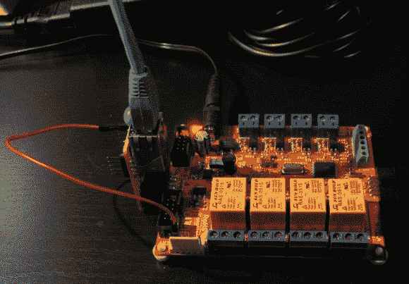

# 嵌入式 Web 服务器就是巧妙的格式化

> 原文：<https://hackaday.com/2013/04/03/embedded-web-server-is-all-about-clever-formatting/>

环顾四周，你会发现各种各样的嵌入式 web 服务器。这个看起来没什么意思，尤其是因为它只是一个插在开发板上的网卡。但对我们来说，有趣的部分是[Andrew Rossignol]如何选择[格式化网页资产，以最好地利用动力不足的服务器](http://www.theresistornetwork.com/2013/03/fun-with-embedded-http-servers.html)。

这个项目是作为[Andrew]正在上的互联网嵌入式系统课程的一部分产生的。该板有一个 ATmega16 微控制器，他在以太网适配器板上使用了非常流行的 ENC28J60。 [TuxGraphics TCP/IP 栈](http://tuxgraphics.org/electronics/200905/embedded-tcp-ip-stack.shtml)负责与网络的通信。

[Andrew]强加给自己的一个约束是只使用一个响应，可用 RAM 限制在 700 字节左右。任何像样的网页都需要至少有一些图片，但由于大小限制，这很难做到。他设法通过优化 Inkscape 中的 SVG 来显示 AVR 徽标，然后使用 VIM 剥离 cruft 的其余部分(休息后在演示中解释)。口袋里装着 Linux-fu，他开始着手简化 CSS 文件。网页也不仅仅是静态的。他显示服务器的正常运行时间，甚至允许控制 Olimex 板上的继电器和 led。

尽管有 ATmega 家族的限制，他们似乎仍然做一些惊人的互联网连接的东西。这里有一个用作《我的世界》服务器的服务器。

[https://www.youtube.com/embed/JGJM64IhKNc?version=3&rel=1&showsearch=0&showinfo=1&iv_load_policy=1&fs=1&hl=en-US&autohide=2&wmode=transparent](https://www.youtube.com/embed/JGJM64IhKNc?version=3&rel=1&showsearch=0&showinfo=1&iv_load_policy=1&fs=1&hl=en-US&autohide=2&wmode=transparent)