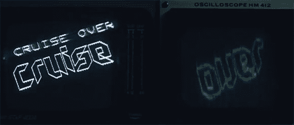

# Playstation 2 上的双显示器

> 原文：<https://hackaday.com/2013/04/02/dual-displays-on-a-playstation-2/>

在上周末举行的 2013 年改版演示会上，想要了解老式视频游戏机编程最新进展的游客和客人得到了真正的款待。【深渊】拿了一台 Playstation 2，把复合视频输出端口连接到电视和示波器上，[造出了第一台双显示器 PS2。](http://pouet.net/prod.php?which=61225)

从[演示的官方视频](http://www.youtube.com/watch?v=er8CoAAmv2A&feature=youtu.be)来看，两个视频信号都是从 PS2 上的一个视频输出中产生的。可以理解，生成复合视频输出相当容易，但第二个显示器(示波器)是在复合信号的 Vblank 期间驱动的。这里没有音频欺骗；视频信号用于视频，音频信号用于音频。

[深渊]在 2013 年修订版的野外演示比赛中获得第一名。也可以理解，因为这是我们见过的最好的演示之一。休息后可以查看来自【深渊】的官方视频，休息后的野赛视频。

[https://www.youtube.com/embed/er8CoAAmv2A?version=3&rel=1&showsearch=0&showinfo=1&iv_load_policy=1&fs=1&hl=en-US&autohide=2&wmode=transparent](https://www.youtube.com/embed/er8CoAAmv2A?version=3&rel=1&showsearch=0&showinfo=1&iv_load_policy=1&fs=1&hl=en-US&autohide=2&wmode=transparent) [https://www.youtube.com/embed/A0plO-FsZ3c?version=3&rel=1&showsearch=0&showinfo=1&iv_load_policy=1&fs=1&hl=en-US&autohide=2&start=2169&wmode=transparent](https://www.youtube.com/embed/A0plO-FsZ3c?version=3&rel=1&showsearch=0&showinfo=1&iv_load_policy=1&fs=1&hl=en-US&autohide=2&start=2169&wmode=transparent)