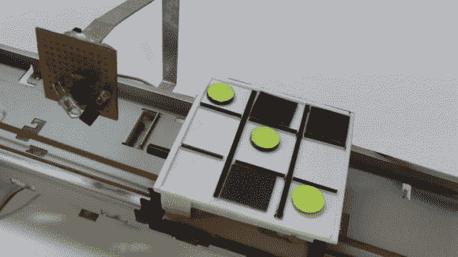

# 数控井字游戏

> 原文：<https://hackaday.com/2013/04/02/cnc-tic-tac-toe/>

这个[电脑控制的物理井字游戏](http://www.instructables.com/id/Tic-Tac-Toe-Machine/)是由从普通消费品中提取的零件构建而成的。具体来说，底座由打印机和 DVD 驱动器部件组合而成。

这一构建令人愉快，在休息后观看它在剪辑中玩游戏之前，你不能进入下一个功能。游戏棋盘可以沿着两个轴移动。从上面的图像中可以明显看出，打印机墨盒滑轨被重复使用，以使电路板左右移动。但是藏在板子下面的 DVD 镜头滑板可以让它前后移动。左边看到的原型板是一个红外反射扫描仪。电路板在该传感器下系统地移动。每当一个黑色方块(由人类玩家放置)在游戏中时，它会阻止红外线反射回来。在这张图片中，您看不到的是刚刚脱离框架的黄色光盘分发器。它使用 DVD 光盘托盘电机来放置计算机的部件。我们认为这个构建只是乞求变成图灵机演示。

如果你喜欢这个游戏，我们相信你也会喜欢[数控象棋](http://hackaday.com/2011/05/23/why-build-a-cnc-mill-when-you-can-have-a-chess-robot-instead/)。

[https://www.youtube.com/embed/Ys2iU41OO0s?version=3&rel=1&showsearch=0&showinfo=1&iv_load_policy=1&fs=1&hl=en-US&autohide=2&wmode=transparent](https://www.youtube.com/embed/Ys2iU41OO0s?version=3&rel=1&showsearch=0&showinfo=1&iv_load_policy=1&fs=1&hl=en-US&autohide=2&wmode=transparent)