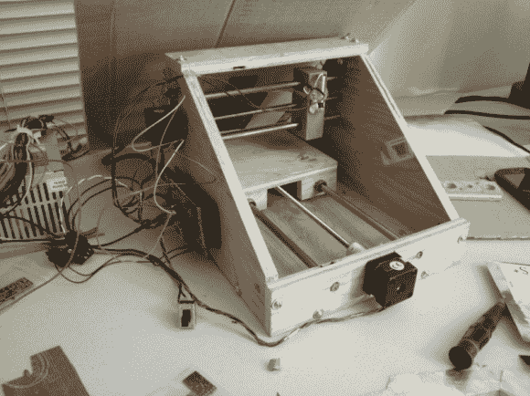

# 自制激光切割机创意

> 原文：<https://hackaday.com/2013/04/03/homebuilt-laser-cutter-ideas/>

[wuza bar]来信告诉我们这个[“PCB 模板 DIY 激光切割机”](http://hardwarebreakout.com/2013/03/diy-laser-cutter-for-pcb-stencils/ "DIY laser cutter")虽然没有为框架提供完整的 BOM 和逐步构建说明，但有构建的图片，并讨论了一些不同的构建选项。另一个特别有趣的选择是使用现成的 RepRap 或其他 3D 打印机作为激光运动控制器。显然[已经在](http://reprap.org/wiki/LaserCut_Mendel "Laser RepStrap")上试验过了，我们很想看看读者们提出的任何版本！

除了一些关于切割机移动部件的不同想法和资源外，还有一些关于如何为此目的连接激光以及所需软件和校准的信息。需要注意的是，如果使用高能激光器，您应该始终佩戴合适的护目镜。虽然任何机床都可能是危险的，但激光也带来了一些安全问题，应该非常谨慎地对待。