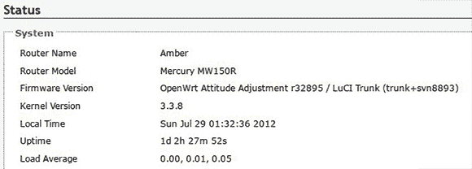

# 用无可挑剔的焊接技能升级路由器

> 原文：<https://hackaday.com/2013/04/03/upgrading-a-router-with-impeccable-soldering-skills/>

[死灵]最近获得了一个几乎免费的路由器。他吹毛求疵，连接了一个串口，看看它是否能运行一些更新的固件，比如 OpenWRT。最初的发现很有希望；它使用了与非常受欢迎的 WR703N 相同的 CPU，但这款免费路由器只有 2 MiB 的闪存和 8 MiB 的 RAM 几乎不足以做任何事情。他对这个问题的解决方案是真正的黑客传统:[只是在路由器上焊接更多的芯片](http://ncrmnt.org/wp/2012/07/29/mercury-mw150r-turning-an-epic-fail-to-an-epic-win/)。

升级内存相对容易；[死灵]找到一个旧的内存棒，拆下其中一个芯片，用一个新的 64 兆字节的芯片取代了可怜的 8 兆字节的芯片。

然而，事实证明闪电更加困难。如果闪存中没有用于无线电测试的正确代码，路由器根本没有用。解决方案是读取原始的 2 MiB 芯片，从 WR703 读取 Flash，并用一个简单的 dd 命令将两者结合起来。这是写入一个新的 SPI 闪存芯片，带有一个总线盗版和一个自制蚀刻板。