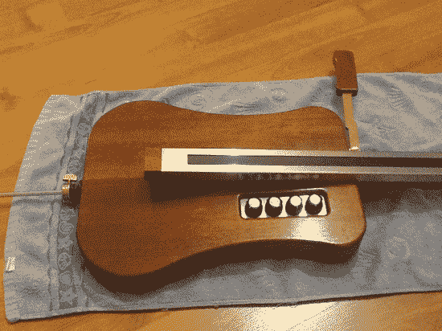

# 建造一座特雷门塞罗

> 原文：<https://hackaday.com/2013/04/03/building-a-theremincello/>

我们完全错过了这个项目。它应该在愚人节那天运行，你不会知道它是真的还是恶作剧。那是因为休息后非常严肃的表演很难不被逗笑。上面显示的仪器是一个特雷明塞罗。这是一种大提琴形状的乐器，功能与特雷门琴类似。

在视频片段中演奏的乐器是第一代，上图中的是它的继任者。创作者希望改进电子设备，使产生的声音不那么“飘飘荡荡”。结果可以在特雷门世界文章的视频中听到，我们认为他们已经实现了目标；听起来好多了！在视频中，[Thierry Frenkel]演示了如何用左手在指板上改变音符。通常拉弦的右手操作控制杆来调节正在播放的音符的音量。

如果单个指板不足以满足你的需求，你可以考虑[建造这种四轨设计来代替](http://hackaday.com/2011/09/22/why-wasnt-this-magnetic-cello-made-in-the-70s/)。

[https://www.youtube.com/embed/uIirvGGhR7M?version=3&rel=1&showsearch=0&showinfo=1&iv_load_policy=1&fs=1&hl=en-US&autohide=2&wmode=transparent](https://www.youtube.com/embed/uIirvGGhR7M?version=3&rel=1&showsearch=0&showinfo=1&iv_load_policy=1&fs=1&hl=en-US&autohide=2&wmode=transparent)

[谢谢大卫]