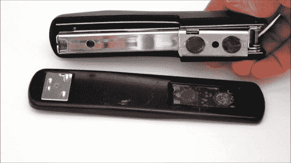

# 订书机 Hack 可以装订无限大的纸张

> 原文：<https://hackaday.com/2013/04/05/stapler-hack-fastens-infinitely-large-sheets-of-paper/>

它不叫无限订书机，但我们认为应该叫它。这种磁性工具允许你使用普通的旧订书机来装订很大的纸张。

限制因素一直是订书机铰链和订书钉出来的地方之间的距离。为了解决这个问题，底座和分配器之间的卷曲连接被钻了出来。然后在上半部分和下半部分钻更大的孔来容纳一组磁铁。当强力胶有时间凝固时，用一些胶带将它们暂时固定住。

结果是两半，分别放在超尺寸纸张的两侧。磁铁负责将订书钉与模具对齐，模具将订书钉弯曲成最终形状。休息后的视频剪辑中显示了整个过程。

[https://www.youtube.com/embed/js-lbtoBAME?version=3&rel=1&showsearch=0&showinfo=1&iv_load_policy=1&fs=1&hl=en-US&autohide=2&wmode=transparent](https://www.youtube.com/embed/js-lbtoBAME?version=3&rel=1&showsearch=0&showinfo=1&iv_load_policy=1&fs=1&hl=en-US&autohide=2&wmode=transparent)