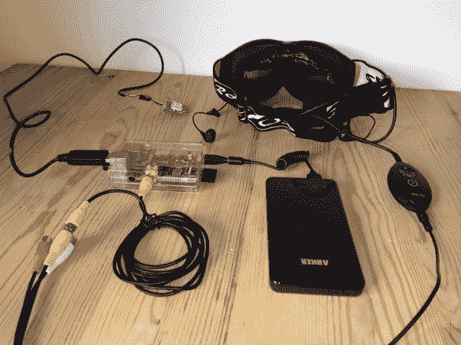

# 滑雪板护目镜 HUD 显示下山时的关键数据

> 原文：<https://hackaday.com/2013/04/05/snowboard-goggle-hud-displays-critical-data-while-falling-down-a-mountain/>

[Chris]一直在努力将[平视显示器安装到滑雪镜](http://random-stuff-of-chris.blogspot.co.uk/2013/03/snowboard-hud-part-10-summary.html)中。我们习惯于看到项目中的组件，但应用程序是意想不到的。他自己警告说，显示器离你的脸太近，如果你摔倒可能会受伤，这凸显了这种建筑的不切实际性。但是，嘿，当涉及到原型时，你必须从某个地方开始。也许下一次迭代将是安全使用的东西。

护目镜的顶部增加了一套 MyVu 眼镜，让佩戴者稍微抬头就可以看到 LCD 输出。显示器由连接到 GPS 模块的 Raspberry Pi 板供电，所有这些都由 USB 备用电池供电。在休息后的视频中，你可以看到显示屏显示了一天中的时间、速度、高度和温度(尽管他还没有接上温度传感器)。他的材料清单显示项目成本约为 160 英镑，不到 250 美元。

[https://www.youtube.com/embed/CoZgNuGUK0g?version=3&rel=1&showsearch=0&showinfo=1&iv_load_policy=1&fs=1&hl=en-US&autohide=2&wmode=transparent](https://www.youtube.com/embed/CoZgNuGUK0g?version=3&rel=1&showsearch=0&showinfo=1&iv_load_policy=1&fs=1&hl=en-US&autohide=2&wmode=transparent)