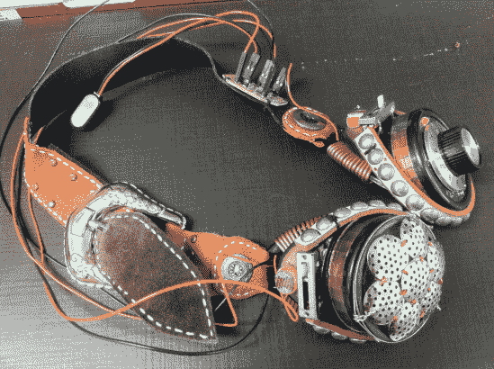

# 蒸汽朋克特雷门护目镜

> 原文：<https://hackaday.com/2013/04/04/steampunk-theremin-goggles/>

许多人制作了定制的蒸汽朋克护目镜，但大多数没有实现任何交互性——它们只是一个美学配件。[Sarah] [最近决定做一双](http://roboticarts.wordpress.com/2013/03/26/theremin-goggles/)除了看起来很酷，还能让佩戴者发出声音。她通过将光学特雷门琴集成到他们的设计中实现了这一点。

为了让建筑既能负担得起又能佩戴，她研究了简化的定时器，最终决定创造一个基本型号，它只使用了少数几个组件和两个 555 定时器。护目镜的主体大部分是用随机错配的金属和皮革制成的。安装在每个镜头的外部边缘，有一个光电传感器和相应的滑块控制。调整滑块会改变阻力水平，从而改变声音的音高。特雷门琴会根据传感器接收到的光量产生不同的音高和八度音。因此，佩戴者或附近的朋友在佩戴者的头部周围挥动他们的手来控制它。

扬声器和音量旋钮被巧妙地伪装成两个“镜头”。旋转音量旋钮透镜可以调节内部电位计，该电位计由定制的激光蚀刻丙烯酸片固定。最重要的是，她甚至用 Eagle 设计了自己的 PCB。

休息之后，请观看视频演示。

[https://www.youtube.com/embed/lhizlCmlbYY?version=3&rel=1&showsearch=0&showinfo=1&iv_load_policy=1&fs=1&hl=en-US&autohide=2&wmode=transparent](https://www.youtube.com/embed/lhizlCmlbYY?version=3&rel=1&showsearch=0&showinfo=1&iv_load_policy=1&fs=1&hl=en-US&autohide=2&wmode=transparent)