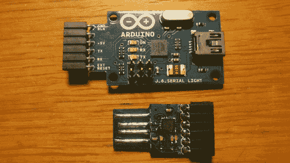

# 滚动您自己的最小 USB 到串行 Arduino 编程器

> 原文：<https://hackaday.com/2013/04/06/rolling-your-own-minimal-usb-to-serial-arduino-programmer/>

[Hans Peter]希望在他的项目中不再使用全 Arduino 板。在开发阶段之后，他很少使用的组件之一是 USB 硬件。一旦固件被刷新到芯片中，他就不再需要它了。因此，他试着用一些非常小的 SMD 部件[构建这个 USB 转串行 Arduino 编程器](http://embryonic.dk/wordpress/?p=195)。

他带走的芯片不是我们习惯的 FTDI 部分。他没有使用 FT232RL，而是选择了更小的型号 FT230x。该芯片并没有完全实现 232 的通信协议，但它可以与 AVRdude 一起工作，这才是真正重要的。上面你可以看到官方 Arduino USB 转串行编程器旁边的[Hans']创作。他使用了相同的连接方案，但使用了 USB 的边缘连接器，而不是使用 mini-B 插孔。

看到他使用 16 引脚 QFN 封装的原型制作令人印象深刻。为了在试验板上测试，他把它焊接到几个银引脚头上。他组装的第一块电路板在 USB 端口上太松了，但他在背面加了一些胶带使其更厚，并在边缘连接器迹线上涂了一点焊料，这就成功了。