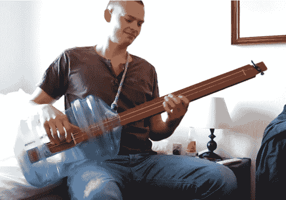

# 原声低音吉他使用水壶和两根弦

> 原文：<https://hackaday.com/2013/04/07/acoustic-bass-guitar-uses-water-jug-and-two-strings/>

乍一看很容易忽略这一点。但是一旦你听到[Tychsen81] [演奏这个东西](http://www.youtube.com/watch?v=KDN1UbFyVwQ)你就会想知道更多。

他早在 2009 年就发布了这个演示。直到一年后，他才拍摄了这个东西是如何制作的细节。琴弦实际上是低音吉他琴弦，A 和 D 弦被调低到 E 和 A，以便与黑色安息日的“铁人”一起演奏。琴颈由两块木板组成。一个作为指板，是无品的。另一个安装在下面，以便为琴马提供负空间，同时保持琴弦在指板的正确高度。水瓶有助于放大声音，这就是为什么琴弦的底端绕过琴桥，穿过琴颈，固定在水瓶的底部边缘。

休息之后，我们嵌入了演示和构建视频。

如果这让你想到了制作自己的乐器，你也会对威猛乐感兴趣。

“铁人”演示:

[https://www.youtube.com/embed/KDN1UbFyVwQ?version=3&rel=1&showsearch=0&showinfo=1&iv_load_policy=1&fs=1&hl=en-US&autohide=2&wmode=transparent](https://www.youtube.com/embed/KDN1UbFyVwQ?version=3&rel=1&showsearch=0&showinfo=1&iv_load_policy=1&fs=1&hl=en-US&autohide=2&wmode=transparent)

构建视频:

[https://www.youtube.com/embed/bzGJQliNIbo?version=3&rel=1&showsearch=0&showinfo=1&iv_load_policy=1&fs=1&hl=en-US&autohide=2&wmode=transparent](https://www.youtube.com/embed/bzGJQliNIbo?version=3&rel=1&showsearch=0&showinfo=1&iv_load_policy=1&fs=1&hl=en-US&autohide=2&wmode=transparent)

[谢谢赫伯]