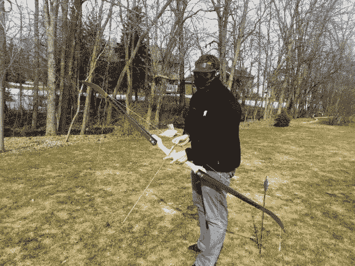

# 用木头和滑雪板制作反曲弓

> 原文：<https://hackaday.com/2013/04/09/recurve-bow-make-from-wood-and-skis/>

第一次测试你自制的弓时，一点面部保护是个好主意。[奥斯汀·卡尔斯] [在他所谓的工程师春假期间做了这个反曲弓](http://imgur.com/a/BecXx)。

在 Reddit 上看到几个类似的项目后，他决定采用这个想法。在第一次起草了一份计划，他前往商店削减木制竖板(弓的中间部分)。不同于传统的反曲弓，它由三部分组成。传统上，你会层压不同类型的木材，以达到所需的灵活性和张力水平。但是[奥斯汀]用了一种合成材料:两个滑雪板的尖端。每个都被切割成最终长度，并用一对螺栓固定到立管上。

几次试射后，他对这个设计有了信心，并取消了面罩。现在，如果你想在市场上购买现有的弓并增加一些火力，你会想看看这款猎枪增强型复合弓。

[谢谢斯凯勒]