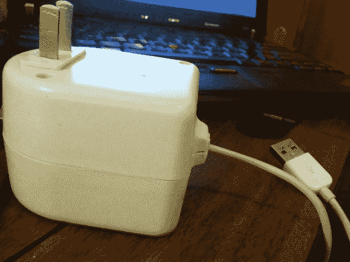

# 壁瘤电脑鼠标

> 原文：<https://hackaday.com/2013/04/09/wall-wart-computer-mouse/>

这个看起来很大的壁瘤实际上是一个电脑鼠标。当然，如果长时间使用，它可能会导致你的手严重抽筋。但有些人会说，这是值得的潮人的东西的价值。

这种奇怪的形状可以从某种程度上解释为什么它来自宜家。在取出塑料盒里的变压器后，他有足够的空间来工作。他钻了一个洞，这样罗技 USB 光电鼠标的传感器就可以拾取鼠标的移动。在按钮方面，他也很有创造力。墙上插头的两个插脚水平旋转，以影响内部的瞬时按压开关。

休息之后，你可以看到该项目的快速演示。[亚历克]不认为它是完整的。他想做一些改进，包括增加重量，让它感觉更像原来的壁疣，并找到一种方法隐藏他为传感器钻的孔。

[https://www.youtube.com/embed/Gfsqprsno_c?version=3&rel=1&showsearch=0&showinfo=1&iv_load_policy=1&fs=1&hl=en-US&autohide=2&wmode=transparent](https://www.youtube.com/embed/Gfsqprsno_c?version=3&rel=1&showsearch=0&showinfo=1&iv_load_policy=1&fs=1&hl=en-US&autohide=2&wmode=transparent)