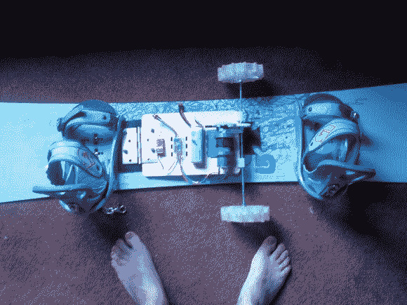

# 滑雪板推进系统马达你通过单位

> 原文：<https://hackaday.com/2013/04/11/snowboard-propulsion-system-motors-you-through-the-flats/>

滑雪者优于滑雪板者的一个优势是能够轻松地通过平坦的路段。[Matt Gardner]建造这个原型是为了帮助公平竞争。当他通常需要踢、跳或移动滑板和行走时，他现在可以启动他的滑雪板电池推进系统。

这个装置的工作原理很像一艘划桨船。滑板两侧伸出的两个轮子推动滑板前进。驱动系统由遥控飞机速度控制器和电池，来自 Harbor Freight 的 18V 钻机的电机和变速箱，以及几个 3D 打印的齿轮和安装支架组成。他使用 3D 打印机制作了一个驱动轮，然后用它制作了一个硅胶模具来铸造上面使用的轮子。整个组件通过门铰链连接到板上。这样，当他下山时，钻机可以旋转到一边(我们假设绑在他的靴子上)。当搭配[一个护目镜内的 HUD](http://hackaday.com/2013/04/05/snowboard-goggle-hud-displays-critical-data-while-falling-down-a-mountain/) 时，这将把单板滑雪带到一个新的水平！

不幸的是，因为已经是四月了，没有雪可以测试，这意味着没有演示视频。但是他告诉我们在草地和地毯上的测试进行得很顺利。