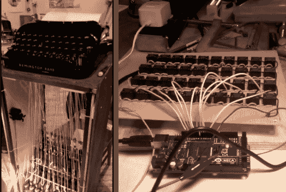

# 自动操作机械打字机

> 原文：<https://hackaday.com/2013/04/11/automating-a-mechanical-typewriter/>

看看这台打字机下面的柜子里正在进行的所有工作。自动化机械打字机的黑客是为了艺术装置，但是建造一个这样的机器作为简历打印机不是很有趣吗？这真的让我们希望我们身边有一台旧打字机。

将它接入电动打字机会容易得多，但是我们已经看到了[在电动打字机上使用的字符串技巧](http://hackaday.com/2010/11/01/typewriter-as-io-lets-you-play-zork/)。在这种情况下，一个绳圈连接到每个键下的杆上，允许从下面拉动来键入字符。汽车门锁执行器([哈维·穆恩]告诉我们它们不是螺线管)连接到每把钥匙的另一端。但是，你必须有一种方法来驱动致动器，这就是右边的 40 个继电器的原型板发挥作用的地方。该图像取自休息后的演示视频，显示了正在测试的电路板。我们猜测稍后会添加更多的线来复用阵列，因为我们不知道 Arduino 如何驱动所有 40 个线，如图所示。有一点我们是肯定的，完成的项目看起来和听起来都很神奇！

[https://player.vimeo.com/video/63481843](https://player.vimeo.com/video/63481843)