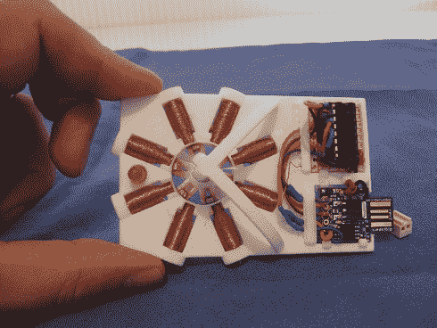

# 工作 3D 打印步进电机

> 原文：<https://hackaday.com/2013/04/13/working-3d-printed-stepper-motor/>

大多数 3D 打印机使用步进电机来控制挤出机头的移动。如果你真的能打印出这些马达，那将是向自我复制硬件又迈进了一大步。现在显然[Chris Hawkins][工作的 3d 打印步进电机](http://www.youtube.com/watch?v=paT63-8DLbs)并不是 100%通过 3D 打印制造的，但大多数零件都是。所有他必须添加的是电子驱动件，磁铁，电线，和一些钉子。

线圈由包在电磁线中的钉子组成。转子是一个 3D 打印框架，接受钕稀土磁体。轮轴是尖的，这减少了它与框架任一侧的锥形支撑的摩擦。右上角的 IC 是一个晶体管阵列，便于切换驱动线圈的 20V 电压。右下角的电路板是 digi spark T1，这是一个 ATtiny85 分线板，包括一个用于编程的 USB 边缘连接器和一个线性调节器，这是他如何摆脱 20V 电源的。

不要错过休息后的演示视频，您可以看到电机一次步进 7.5 度。

[https://www.youtube.com/embed/paT63-8DLbs?version=3&rel=1&showsearch=0&showinfo=1&iv_load_policy=1&fs=1&hl=en-US&autohide=2&wmode=transparent](https://www.youtube.com/embed/paT63-8DLbs?version=3&rel=1&showsearch=0&showinfo=1&iv_load_policy=1&fs=1&hl=en-US&autohide=2&wmode=transparent)