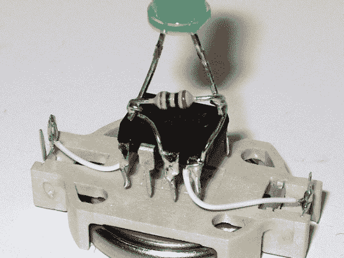

# 异步萤火虫使用的零件很少

> 原文：<https://hackaday.com/2013/04/19/asynchronous-fireflies-use-few-parts/>

[Karl Lunt]来信分享了他的 LED 萤火虫项目。他的项目目标是开发一种低功耗、低部件数的模块，它可以感知黑暗，然后模仿你会联想到它的生物同名物的闪烁模式。

我们喜欢他的设计，它使用一个硬币电池座作为该项目的底盘。驱动硬件的附件由两根电源线固定。这让他可以通过旋转芯片并插入他制作的小适配器来刷新新固件。LED 连接对您来说可能有点奇怪。它有一个并联电阻，不满足限流电阻的正常作用。那是故意的。[Karl]在没有任何电流限制的情况下驱动 LED，使用 3V 电池和二极管的短发光时间应该没问题。当他使用 LED 作为光传感器时，电阻器就发挥作用了。过去的 firefly 项目包括光敏电阻来检测光线并同步多个单元。[Karl]放弃了 LDR，使用 LED 和并联电阻来对抗二极管的电容特性。正如我们提到的，这可以感应环境光，但我们希望看到一个更新，也可以使用 LED 来同步一组设备。