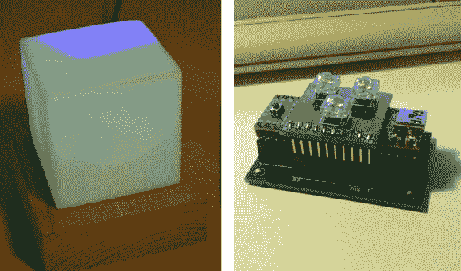

# 情绪灯/通知器采用简洁的模块化 PCB 设计

> 原文：<https://hackaday.com/2013/04/20/mood-lampnotifier-uses-neat-modular-pcb-design/>

[J. Sutton]制作的这个情绪灯不仅看起来很棒，而且我们喜欢他在制作电路板时采用的模块化设计。

如果你正在做的东西会放在你的桌子上一段时间，它必须看起来很好。我们认为他做到了这一点，用一小块橡木作为基底，用一个来历不明的白色立方体作为漫射体。请注意，不同的颜色没有混合。扩散器内有一个挡板，使它们分开，因为早期的测试显示，任何强度的组合都会产生几乎相同的颜色。

我们真正喜欢的部分是他电路板的模块化设计。该项目基于 Teensy++ 2.0 板。他首先制作了一个 PCB 基板，上面有两个银插座，可以容纳青少年的腿。还有第三个 SIL 插座，可以接受 LED 主板的一些长腿，让它栖息在 Teensy 的顶部。

[https://www.youtube.com/embed/CaFS0iNwX_M?version=3&rel=1&showsearch=0&showinfo=1&iv_load_policy=1&fs=1&hl=en-US&autohide=2&wmode=transparent](https://www.youtube.com/embed/CaFS0iNwX_M?version=3&rel=1&showsearch=0&showinfo=1&iv_load_policy=1&fs=1&hl=en-US&autohide=2&wmode=transparent)