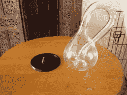
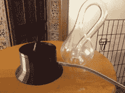
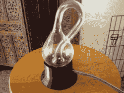
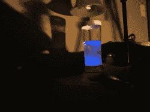
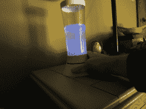
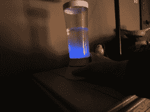

# 发光藻类的生活夜灯

> 原文：<https://hackaday.com/2013/04/18/living-night-light-with-glowing-algae/>

[https://www.youtube.com/embed/TsMTDnd8lZE?version=3&rel=1&showsearch=0&showinfo=1&iv_load_policy=1&fs=1&hl=en-US&autohide=2&wmode=transparent](https://www.youtube.com/embed/TsMTDnd8lZE?version=3&rel=1&showsearch=0&showinfo=1&iv_load_policy=1&fs=1&hl=en-US&autohide=2&wmode=transparent)

在这个视频中，我可能听起来有点过于热情了。我没有。看过这个的人都觉得简直太神奇了。

我父亲曾是一名海军，从小就给我讲发光水的故事。作为一个痴迷于所有发光事物的人，这一点一直困扰着我。有一天我看到一个标题，说有人在做海藻灯。可悲的是，当我点击它时，藻类只是在那里制造氧气。这是一个很酷的想法，但不是我所希望的。

这种轻微的失望驱使我用发光的海藻创造了一盏夜灯。这个过程可能非常简单。

1.[买海藻](http://empco.org/edu/index.php/pyrocystis-fusiformis-11.html)。

2.为藻类设置光源(它需要 12 小时的光照周期，把它放在窗台上会因高温而杀死它)。它需要标有 6500k 或更高的灯泡。

3.晚上摇摇海藻(它只有在被搅动时才会发光，而且是在它的“夜”周期中)。

不过我真的想给这个项目添加更多东西，所以我决定把海藻放在一个克莱恩瓶子里，并为它建造一个定制的底座，这样我就可以使用磁铁在瓶子里移动 BB 了。这有望反过来搅动藻类，使其发光。

我建造这个基地时考虑的是 DC 发动机。我把它放了进去，增加了动力，但是旋转太快了，BB 不能“锁住”磁铁。我打算构建一个小型 Hbridge 来进行 PWM，但我的抽屉里没有这些东西，也不想去商店。所以，我在里面塞了一个伺服系统。它起作用了，我认为来回的 BB 是一个很酷的奖励。你可以在这里下载基地的文件。

base

optional motor base

all together

为了获得强烈的光线，你必须用力摇晃藻类。我怀疑 BB 只是不打算扰乱他们足够真正发光。作为备份，我带了我的一个孩子的玩具，一个“龙卷风机器”,基本上是一个不透水的管子，底部有一个旋转的桨。我是对的，龙卷风机器要亮得多，但出现了漏洞。

真正令人沮丧的是，我就是无法在视频上捕捉到这种效果。在我看来，它很亮，长时间曝光的照片很好地显示了它，但我的相机都没有拍到。我看过这个东西的视频，所以我特别生气。

最终，我把它移到了我床边的一个更大的容器里，并添加了一些其他的海藻。我点击它，结果就像一个微小的烟花表演在我眼前。它是如此的奇异和美丽。

这是我找到的效果图。这不是我的设置，但你可以看到我在这里说什么。

