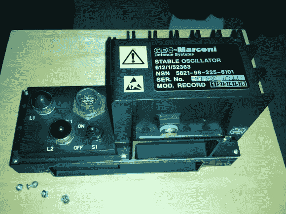

# 20 磅和直觉产生一个可配置的铷原子钟源

> 原文：<https://hackaday.com/2013/04/22/20-pounds-and-a-gut-feeling-yields-a-configurable-rubidium-atomic-clock-source/>

所以你看到这样一幅图像和描述“飞机稳定振荡器”在易贝上市 20 英镑(约 30 美元)，你会怎么做？如果你是[Alecjw],你买下这个东西，然后打开它，在里面找到一个原子钟源。但他真的在这一点上走得很远，并想出了如何从工厂设置的方式重新配置源。

首先，它是为航空业制造的这一事实意味着它的工艺简直棒极了。外壳是机械加工的铝，所有的部件都用胶粘或其他方式连接到板上，以帮助它们经受住飞机上经常经历的高振动。拆卸了一段时间后,[Alec]找到了一个标有“铷频标”的黑盒子……中奖了！他一直希望一个 10 兆赫的信号用于他的测试设备，但当他把它连接起来，源输出 800 千赫。经过进一步调查，他发现了如何重新配置支持电子设备以获得 10 Mhz 信号源。我们认为你会喜欢阅读他如何在重新配置步骤中使用测试晶体。

一旦他知道他有什么，他回到易贝卖家，并清除了他的存货。

【感谢 DIY DSP】