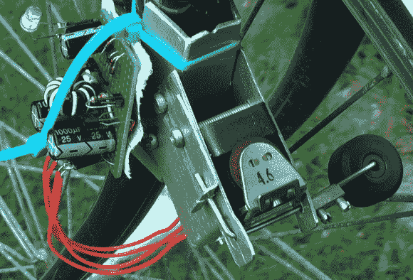

# 拨浪鼓发电机是一种新型的自行车发电机

> 原文：<https://hackaday.com/2013/04/23/rattle-generator-is-a-new-type-of-dynamo-for-a-bicycle/>

这个项目是我们最喜欢的类别之一；问“为什么”的那种是错误的问题。[Berto A.]通过在一个机械继电器线圈旁边放置一个大磁铁，并快速点击继电器的杠杆，观察到一些发电，然后建造了这个设备。从这个卑微的开始，他建立了 RattleGen，一个自行车辐条驱动发电机。

为了获得尽可能多的能量，他四处寻找一个巨大的继电器，并找到了一个原本用于电话交换的继电器。他切开箱子，在线圈旁边绑了一个大磁棒。接下来，他制作了一个能压住继电器杠杆的手臂。除此之外，他还增加了一个小轮子，每当自行车的辐条经过它时，它就会被压下。继电器杆的这种重复点击产生电流(和咔哒咔哒的声音),该电流被构建在一些原型板上的焦耳采样电路收集。LED 点亮，过量电流存储在电容器组中。休息之后，不要错过构建和演示视频。

[https://www.youtube.com/embed/QwbCTU6-8jQ?version=3&rel=1&showsearch=0&showinfo=1&iv_load_policy=1&fs=1&hl=en-US&autohide=2&wmode=transparent](https://www.youtube.com/embed/QwbCTU6-8jQ?version=3&rel=1&showsearch=0&showinfo=1&iv_load_policy=1&fs=1&hl=en-US&autohide=2&wmode=transparent)