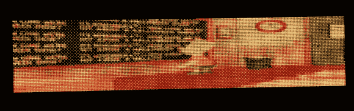

# 旧的 LED 字幕变成嵌入式视频播放器

> 原文：<https://hackaday.com/2013/04/26/old-led-marquee-turned-embedded-video-player/>

[Sprite_TM] is 被他的黑客项目的一个匿名粉丝送去了一个旧的 LED 跑马灯。显示器不是全彩色的，但它很大——224×48 像素——他认为他可以用双色二极管渲染一些不错的图像。最后，[他换掉了控制器，把它变成了视频播放器](http://spritesmods.com/?art=ledboardsolari&f=had)。

最初的系统工作得很好，但驱动显示器的 100 MHz 486 工业风格的 PC 最近似乎有点滑稽。在让它旋转并测试了它如何驱动显示器之后,[Sprite]连接了一个 FTDI 芯片，并设法让它播放他电脑上的视频。上面你可以看到《辛普森一家》的部分开场。

既然他已经知道了它的秘密，他开始给它植入控制器。他的第一次尝试是用一块杨桃板，这是他在 T1 之前用过的。事实证明，对于他推送的所有像素数据来说，这有点慢，所以他升级到了 Raspberry Pi，再也没有回头。跳完可以看演示视频。

[https://www.youtube.com/embed/3yA3-tsGEUY?version=3&rel=1&showsearch=0&showinfo=1&iv_load_policy=1&fs=1&hl=en-US&autohide=2&wmode=transparent](https://www.youtube.com/embed/3yA3-tsGEUY?version=3&rel=1&showsearch=0&showinfo=1&iv_load_policy=1&fs=1&hl=en-US&autohide=2&wmode=transparent)