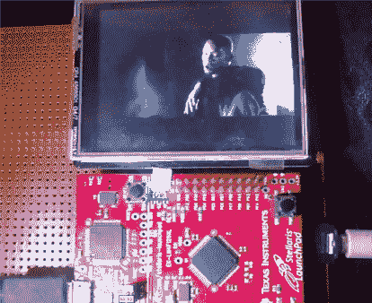

# 从 Stellaris Launchpad 构建的视频播放器

> 原文：<https://hackaday.com/2013/04/27/video-player-built-from-stellaris-launchpad/>

我们认为看到 Stellaris Launchpad 以相当高的帧速率同时播放视频和音频令人印象深刻。对于这些项目来说，这一定是一年中受欢迎的时候，因为我们昨天刚刚看到[另一个视频播放黑客](http://hackaday.com/2013/04/26/old-led-marquee-turned-embedded-video-player/)。但是对于这个项目来说，Vinod 的马力要小得多。

他使用的是 320×240 的显示器，这是我们自己在这块板上试用过的。并行推送图像数据已经足够快了，但如果你正在寻找全动态视频*和*音频，我们会告诉你运气不好。[Vinod 的]数学表明，对文件进行一点黑客攻击是可能的。首先，由于源文件是宽屏的，他只能以 25 fps 的速度写入 320×140 的像素。音频以每秒 22，400 字节的速度推送。这使得他在两帧之间几乎没有时间做任何事情。因此，他将该片段编码为一个原始文件，将视频和音频信息交织在一起，这样该文件就可以作为一个单独的流来读取。从休息后的演示来看，它看起来和听起来都棒极了！

[https://www.youtube.com/embed/P6ZIn2d_eBw?version=3&rel=1&showsearch=0&showinfo=1&iv_load_policy=1&fs=1&hl=en-US&autohide=2&wmode=transparent](https://www.youtube.com/embed/P6ZIn2d_eBw?version=3&rel=1&showsearch=0&showinfo=1&iv_load_policy=1&fs=1&hl=en-US&autohide=2&wmode=transparent)