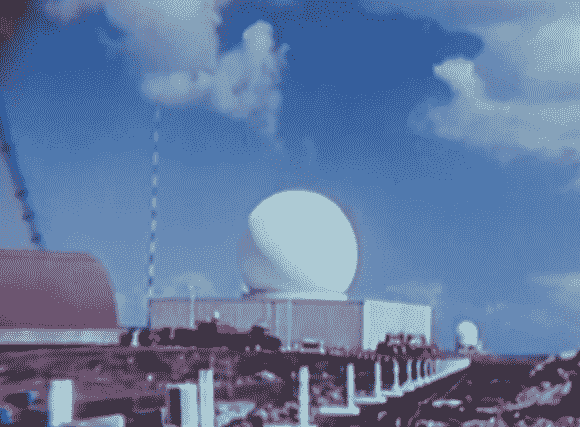

# 回顾:美国反弹道导弹系统的历史

> 原文：<https://hackaday.com/2013/04/30/retrotechtacular-history-of-the-u-s-antiballistic-missile-systems/>

在本期回顾节目中，我们来看看美国反弹道导弹系统的历史。冷战是技术发展的巨大推动力，这种导弹防御就是一个很好的例子。最基本的是，这是一个能够三维跟踪物体的雷达系统。它利用独立的发射器和接收器，这些发射器和接收器同时同步旋转。

这部大约 45 分钟的电影引起了我们的注意，因为[达米特]对系统使用的[吕纳堡镜头](http://en.wikipedia.org/wiki/Luneburg_lens)感兴趣。在大约 11:10 分的视频休息后，我们开始讨论这个部分。在一个像上面看到的圆顶内，有一个由聚苯乙烯泡沫块制成的反射器，上面还缀有一些金属。这个镜头是固定的，当天空中的物体反射的回声被镜头聚焦时，接收器围绕它旋转来收集发射器的波。

[https://www.youtube.com/embed/ARx2-wRn9-Y?version=3&rel=1&showsearch=0&showinfo=1&iv_load_policy=1&fs=1&hl=en-US&autohide=2&wmode=transparent](https://www.youtube.com/embed/ARx2-wRn9-Y?version=3&rel=1&showsearch=0&showinfo=1&iv_load_policy=1&fs=1&hl=en-US&autohide=2&wmode=transparent)