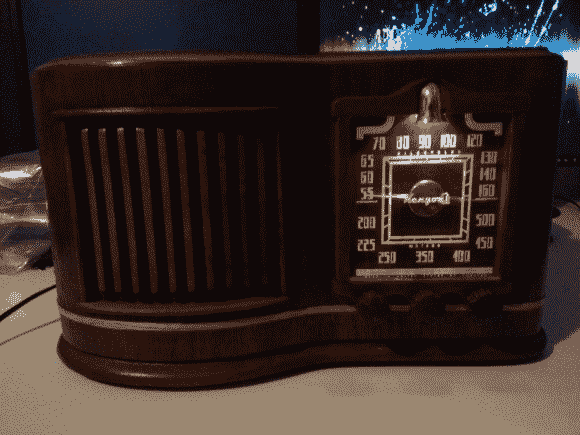

# 调幅广播恢复，并给予 MP3 播放

> 原文：<https://hackaday.com/2013/05/02/am-tube-radio-restored-and-given-mp3-playback-too/>

这台调幅收音机看起来有点像出厂时的样子。但是引擎盖下有很多变化，面板是一个全新的补充。这个项目实际上是一个有所增加的修复项目，[迈克尔·罗斯][在记录项目](http://mycrazycorner.com/?page_id=528)方面做得很好。

凯尼恩收音机建于 1946 年，使用真空管作为放大器。考虑到它的年龄，这是相对较好的状态，而且[迈克尔]开始做的第一件事是让电子设备再次工作。它包括更换内部杂乱的电容器。然后，他清理了管道，检查是否有任何问题，并将电子设备放回一起，发现它们工作正常！

他清理了底盘，给它上了一层新漆。原来的表盘不见了，所以他做了一个木头框架来匹配他订购的刻度盘。钟形黄铜盖隐藏了照亮表盘的光线。

他本可以就此打住，但如今人们真正听调幅广播的有多少呢？为了确保他真的会使用这个东西，他添加了一个带 MP3 屏蔽的 Arduino。它通过继电器接入天线端口，将现代音乐注入旧的放大器电路。休息后在视频中瞥见最后的项目。

[https://www.youtube.com/embed/mku51Ofd1_Q?version=3&rel=1&showsearch=0&showinfo=1&iv_load_policy=1&fs=1&hl=en-US&autohide=2&wmode=transparent](https://www.youtube.com/embed/mku51Ofd1_Q?version=3&rel=1&showsearch=0&showinfo=1&iv_load_policy=1&fs=1&hl=en-US&autohide=2&wmode=transparent)