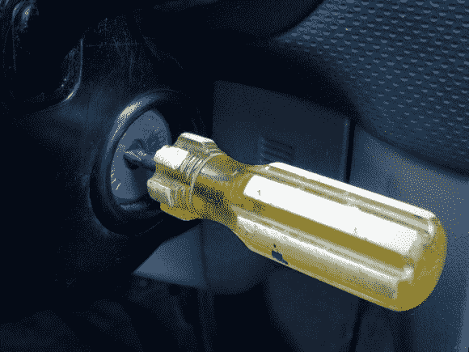

# 用螺丝刀启动你的汽车

> 原文：<https://hackaday.com/2013/05/02/using-a-screwdriver-to-start-your-car/>

[哈哈伯德]用这个螺丝刀启动他的车。不管它看起来像什么，只有这个特殊的螺丝刀会启动点火，因为它仍然使用钥匙锁。他所做的是[改变螺丝刀作为钥匙](http://imgur.com/a/Ea9d6)的延伸。这纯粹是审美，但你必须承认，它看起来很粗糙挂在驾驶杆。

黑客只需要切掉钥匙和螺丝刀不需要的部分。随着工具的轴被切割成合适的尺寸，他用老虎钳夹住它，并用弓锯在上面切一个槽。从那里他走向砂轮，磨平锋利的边缘。

钥匙本身的手柄部分被切掉，并在砂轮上变薄，以紧贴螺丝刀槽。为了使这两块永久结合，他使用了一个火炬和一些银焊料。

[via [Reddit](http://www.reddit.com/r/DIY/comments/1d96px/drive_it_like_you_stole_it_turning_a_screwdriver/)