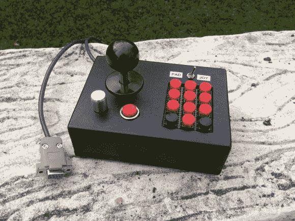

# 雅达利组合控制器有你需要的任何墨盒

> 原文：<https://hackaday.com/2013/05/03/atari-combo-controller-has-what-you-need-for-any-cartridge/>

复古游戏爱好者请注意:这个操纵杆是你在原始主机上玩任何雅达利游戏所需的[。它直接插入原来的控制台硬件，消除了单独选择操纵杆、拨片或键盘控制器的需要。你只要把这只小狗挂起来，然后把你的手移到每一个游戏的控制装置上。](http://www.instructables.com/id/Atari-Combo-Controller/)

[x2Jiggy]从零开始建造这个东西。附件是工艺品商店的一个木箱。他用几个磁性插销把它关上，就像你在老式厨柜上看到的那样。键盘上的按钮安装在一大块原型板上，但他确实花了时间给它涂上一层匹配的油漆，这样它就不会显得格格不入。在里面你会发现更多的原板和点对点焊接来完成其余的连接。

休息之后，您可以看到构建过程的快速运动视频。这让我们想起了为[项目 Unity](http://hackaday.com/2013/04/15/original-hardware-for-fifteen-consoles-jammed-into-recently-completed-project-unity/) 打造的通用控制器。

[https://www.youtube.com/embed/tDcLJRc00wk?version=3&rel=1&showsearch=0&showinfo=1&iv_load_policy=1&fs=1&hl=en-US&autohide=2&wmode=transparent](https://www.youtube.com/embed/tDcLJRc00wk?version=3&rel=1&showsearch=0&showinfo=1&iv_load_policy=1&fs=1&hl=en-US&autohide=2&wmode=transparent)