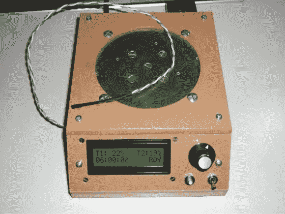

# 热板搅拌器溶解 3D 打印物体中的支撑材料

> 原文：<https://hackaday.com/2013/05/03/hot-plate-stirrer-dissolves-support-material-in-3d-printed-objects/>

当你想打印一个 3D 对象时，如果有一个部件下面什么也没有，你就会遇到问题。从挤压机出来的又热又软的细丝在变硬时，如果没有东西支撑，就会因重力而下垂。解决方案是使用第二种材料作为支撑。但是当印刷完成后，你必须找到一种方法来移除支撑结构。这就是这种美出现的地方。这是一个用来溶解聚乳酸的加热搅拌板。

使用第二个挤出机头印刷 PLA。一旦零件冷却后,[Petrus]将其放入氢氧化钠(碱液)加热浴中。溶剂将去除 PLA，但不会损害 ABS。说到 ABS，【Petrus】还提到这可以兼作温控热板，用于[使用丙酮蒸汽](http://hackaday.com/2013/02/26/giving-3d-printed-parts-a-shiny-smooth-finish/)抛光 ABS 印刷品。

这种动物体内有各种各样的好东西，所以请查看[完整计划](http://reprap.org/wiki/Hot_plate_stirrer)以了解更多。我们最喜欢的部分是搅拌棒，它是一根螺杆和几个螺母。为了让它安全地浸入化学物质中，他 3D 打印了一个药丸形状的外壳。

[谢谢马特]