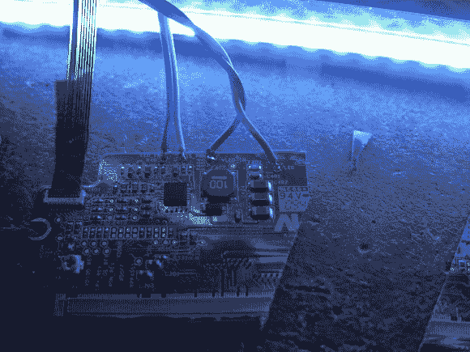

# 笔记本电脑背光从 CCFL 转换为 LED

> 原文：<https://hackaday.com/2013/05/04/laptop-backlight-converted-from-ccfl-to-led/>

[Lee Davison]收购了一台不再有显示屏的宏基笔记本电脑。他手头有足够的零件来添加一个液晶面板，并给它一个 CCFL 背光。但当他开始寻找逆变器来驱动背光时，他找不到。他手头上确实有一些破碎的 LED 背光屏幕，因此 [CCFL 到 LED 背光转换项目](http://mycorner.no-ip.org/misc/ledback/index.html)诞生了。

他打开 LED 显示屏，找到了驱动板。不幸的是，他没有找到确切的 LED 驱动器的数据手册，但他找到了一个类似的，并能够跟踪 PCB 上的支持电路。这让他可以在不损坏驱动器的情况下切掉板上不需要的部分。他不想拔出 CCFL 电子管，直到他确定 LED 转换可以工作，所以他在另一个破碎的面板上进行尝试(他从哪里想到所有这些部件),效果非常好。一旦一切就绪，他对结果非常满意。该系统唯一的缺点是他没有调暗背光的能力。