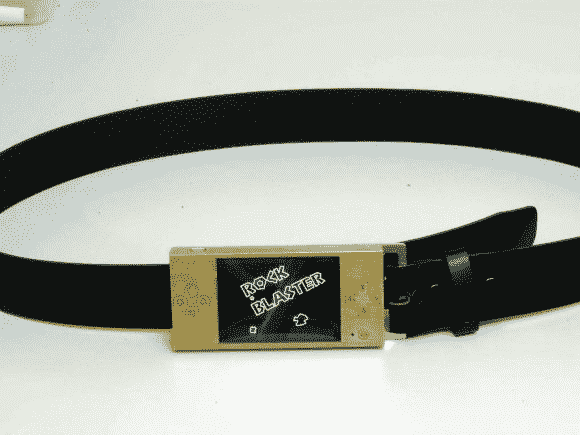

# 星号:皮带扣

> 原文：<https://hackaday.com/2013/05/05/asteriods-the-belt-buckle/>

这将改变你和自己玩耍的方式。如果每次你觉得有点无聊的时候，你就伸手去拿你的腰带，而不是你的智能手机，会怎么样？[狡猾的家伙]可能会更经常这样做，因为他完成了这个看起来光滑的视频游戏[皮带扣，玩经典的小行星游戏](http://www.instructables.com/id/The-Asteroid-Belt/)。

这不仅仅是一个有趣的概念。这个版本是以非常高的质量水平完成的…这个东西经受住时间的考验应该没有问题。首先，他必须弄清楚是否有可能以相当高的帧率运行游戏。廉价的 320×240 LCD 屏幕没有帧标记(可以把它想象成一个垂直同步信号，可以用作微控制器的中断)。但他认为，有可能是帧标记引脚没有像更昂贵的屏幕那样连接，他至少对他获得的一个模型是正确的。

这样一来，他设计并蚀刻了一个漂亮的双面电路板来容纳所有的电子设备。但他仍然需要一个箱子。为了获得独一无二的外观，他在一片黄铜上做了掩模和蚀刻。一旦被裁剪和折叠，钛会给人一种奇妙的感觉，并很好地保护里面的电子设备。