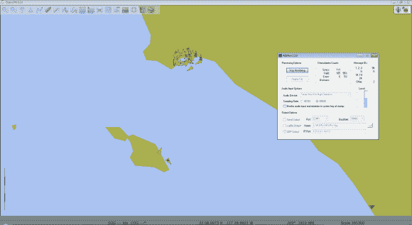

# 使用软件无线电(SDR)跟踪船只

> 原文：<https://hackaday.com/2013/05/06/tracking-ships-using-software-defined-radio-sdr/>

当我们第一次听说软件定义的无线电黑客(通常使用不到 20 美元的 USB 加密狗)时，我们并没有完全掌握这种灵活性的范围。但是现在我们已经看到了几个现实生活中的例子来证明这个概念。例如，你知道吗 [SDR 可以用来追踪船只](http://www.rtl-sdr.com/rtl-sdr-tutorial-cheap-ais-ship-tracking/)？许多国家要求大大小小的船只使用自动识别系统( [AIS](http://en.wikipedia.org/wiki/Automatic_Identification_System) )应答器。该协议最初是为防止大型船只碰撞而开发的，但当硬件成本变得可以承受时，该系统也被用于较小的船只。

[Carl]来信分享他的项目(上面有链接)。就像 4 月份的警察扫描仪项目一样，这利用了电视调谐器加密狗形式的 RTL-SDR。他使用 SDRSharp 软件和八木宇田。捕捉到的数据然后被解码，并使用[的 ship lotter](http://www.coaa.co.uk/shipplotter.htm)绘制在地图上。