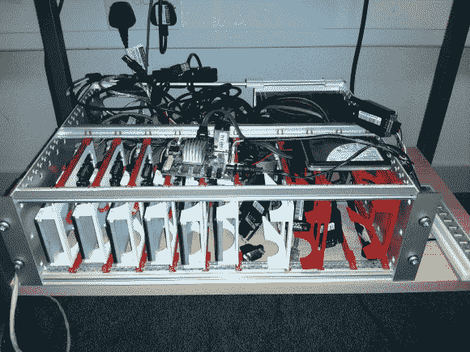

# 用于定制刀片式服务器类型安装系统的 3D 打印机

> 原文：<https://hackaday.com/2013/05/07/3d-printer-used-to-make-custom-blade-server-type-mounting-system/>

我们通常可以将电子产品拼凑成有用的东西。但是，找到一个对建筑有意义的外壳可能是一个真正的阻力。在这种情况下，[文森特·桑德斯]已经有了一个利用多个 arm 板的功能的工作 ARM 构建场。但是它堆在房间的角落里，如果它需要维修或扩展，那就像钻个洞一样有趣。但不再是了。他从刀片式服务器机架的工作方式中获得灵感，并为硬件 [3D 打印了他自己的模块化导轨系统](http://vincentsanders.blogspot.co.uk/2013/04/when-you-make-something-cleaning-it-out.html)。

现在，每组板都牢固地固定在各自的插槽中。上面看到的集合安装在一个服务器机架上，它有自己的电源。这张图片是改造的一部分，这解释了为什么还有一堆乱七八糟的东西。[Vincent]没有打印连续的轨道，而是使用一根螺杆来跨越较大的框架，通过拧紧两侧的螺母来固定小块的轨道。白色和红色托盘是他从 Shapeways 订购的印刷品，旨在固定 [eurocard 外形尺寸](http://en.wikipedia.org/wiki/Eurocard_(printed_circuit_board))的零件。

[谢谢托马斯]