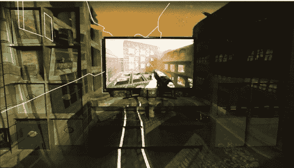

# 微软 IllumiRoom 将您的视频游戏从电视监狱中解放出来

> 原文：<https://hackaday.com/2013/05/03/microsoft-illumiroom-breaks-your-video-game-out-of-its-television-prison/>

我们看到很多视频游戏技术来自三大主机巨头(微软、索尼和任天堂)。只要看一眼，我们通常就能预测什么会失败。Wii U 和索尼 Move 就是一个例子，Wii U 的销量一直不太好，索尼 Move 是运动控制领域的硬核游戏，我们相信他们对目前双震动控制器的发展非常满意。但这一次，我们认为微软已经搞定了。他们正在展示一项名为 IllumiRoom 的技术，该技术使用投影仪将整个游戏室带入体验中。

上面的图像是*而不是*修改过的。这是一张 IllumiRoom 的照片。咖啡桌上的投影仪会自动校准房间(使用 Kinect 3D 数据进行映射)，以便在不平坦的投影表面上显示逼真的图形渲染。在我们看来，这直接来自 Kinect 黑客项目，如[Hadouken 投影仪](http://hackaday.com/2011/01/19/projector-tricks-make-use-of-kinect-3d-mapping/)。有了这一点，游戏设计者可以自由地想出各种不同的方法来使用这个特性。休息之后请继续关注我们，看看他们的进展。

[https://www.youtube.com/embed/sJ4hWa6y710?version=3&rel=1&showsearch=0&showinfo=1&iv_load_policy=1&fs=1&hl=en-US&autohide=2&wmode=transparent](https://www.youtube.com/embed/sJ4hWa6y710?version=3&rel=1&showsearch=0&showinfo=1&iv_load_policy=1&fs=1&hl=en-US&autohide=2&wmode=transparent)

[通过[汤姆的硬件](http://www.tomshardware.com/news/IllumiRoom-Kinect-Field-of-Vision-Xbox-Infinity-InFocus-IN126ST,22312.html)感谢迈克尔]