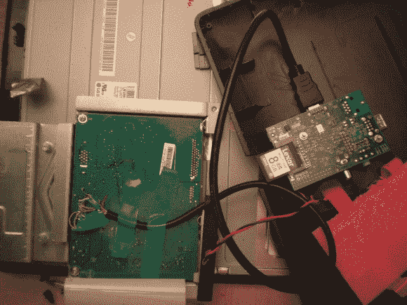

# 树莓皮藏在电脑显示器里

> 原文：<https://hackaday.com/2013/05/09/raspberry-pi-housed-inside-a-computer-monitor/>

看，我们一直想要的东西。[Matthieu]将他的 [Raspberry Pi 板安装在电脑显示器](http://www.raspberrypi.org/phpBB3/viewtopic.php?f=64&t=42223)内。他的工作是我们能想到的最便宜的智能电视改装。

上图显示显示器的驱动板在左边，树莓派安装在后面的塑料盖。[Matthieu]使用一根短的 HDMI 电缆连接两者。HDMI 连接器直接插入 RPi。另一端已被切断，电线焊接到显示器的 PCB 上的 DVI 引脚。这不是问题，因为 [HDMI 和 DVI 使用电气上相同的协议](http://en.wikipedia.org/wiki/Hdmi#Compatibility_with_DVI)。唯一缺少的是音频。但是如果你用一个有 HDMI 接口的设备(比如一台电视机)来完成同样的任务，那也只是焊接音频连接的问题。当他用熨斗加热时，他还将监控板上的 5V 电源连接到 RPi 上。他通过在显示器外壳上切一个槽来允许访问 SD 卡，从而完成了他的黑客攻击。

我们一直想要一台 XBMC 电脑，我们可以把它 velcro 到电视机后面，结果发现 RPi 正是我们想要的东西。现在我们必须考虑打开电视来复制这种内在化的黑客行为！