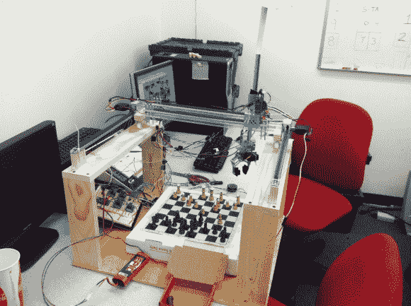

# 声控象棋机器人

> 原文：<https://hackaday.com/2013/05/09/voice-controlled-chess-robot/>

[Ben Yeh]写信告诉我们这个[声控象棋机器人](http://benpyeh.wordpress.com/2013/05/02/carlsenbot-detailed-report-long-post/)是他和其他三个人一起为佐治亚理工学院 ECE 4180 嵌入式系统设计课程做的最后一个项目。

为了处理语音识别，他们拿了一块 EasyVR 板。这是一个很好的解决方案，因为它不需要计算机来处理语音命令(记住，这是一个嵌入式系统类)。当你发现机器人旁边的台式电脑就是象棋游戏运行的地方，这个概念就不成立了。也许下一批 4180 名学生可以将它转移到微控制器上。

该项目的机器人手臂部分在休息后的剪辑中显示得很好。通常我们会看到步进电机驱动数控机床的轴，但在这种情况下，他们使用内置编码器的伺服电机。编码器是向主控制器反馈信息的 i2c 设备。零件订购混乱，z 轴电机没有编码器。没问题，他们只是增加了一个距离传感器和一个反射器来测量爪子的上下运动。

[https://www.youtube.com/embed/oHpp640y8q4?version=3&rel=1&showsearch=0&showinfo=1&iv_load_policy=1&fs=1&hl=en-US&autohide=2&wmode=transparent](https://www.youtube.com/embed/oHpp640y8q4?version=3&rel=1&showsearch=0&showinfo=1&iv_load_policy=1&fs=1&hl=en-US&autohide=2&wmode=transparent)