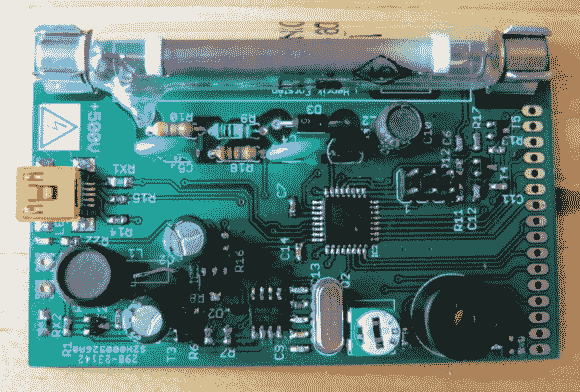

# 盖革计数器告诉你你的盘子是否有放射性

> 原文：<https://hackaday.com/2013/05/13/geiger-counter-tells-you-if-your-dishes-are-radioactive/>

[Henrik]真的制作了一个漂亮的小盖革计数器板,基于冷战时期的盖革管。

它的运作方式与[沿线的](http://hackaday.com/2011/04/07/geiger-counter-built-in-an-ohmmeter-enclosure/)[其他项目](http://hackaday.com/2012/09/08/beautifully-crafted-geiger-counter-a-must-if-you-live-in-a-hot-zone/)大致相同。如果需要的话，它可以使用电池，这是一个不小的成就，因为电子管需要高电压才能正常工作。休息后的视频显示，当通过 USB 连接到电脑时，它会将读数输出到终端窗口。

但真正引起我们注意的是他用于测试的放射源材料。因为他手头没有任何东西，他不得不点些东西，最后吃了几块餐盘上的碎片。确切地说是一个放射性餐盘，这是一个你以前可能听说过的品牌名称。红色节日器皿显然曾经是放射性的。它甚至在维基百科文章的介绍中被提及。真不敢相信

我们注意到的另一件事是[Henrik]将万用表连接到试验板的方法。其中一张项目照片展示了顶端缠绕着细金属丝的探针。我们认为这是为了方便插入试验板。

尽管这个小偏离了主要项目，我们真的很喜欢了解他的建设。你可以看到他在广告之后的片段中展示了这一点。

[https://www.youtube.com/embed/EQGzX98yszE?version=3&rel=1&showsearch=0&showinfo=1&iv_load_policy=1&fs=1&hl=en-US&autohide=2&wmode=transparent](https://www.youtube.com/embed/EQGzX98yszE?version=3&rel=1&showsearch=0&showinfo=1&iv_load_policy=1&fs=1&hl=en-US&autohide=2&wmode=transparent)