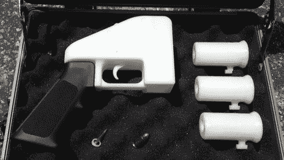

# 第一把 3d 打印枪已经开了，我不在乎。

> 原文：<https://hackaday.com/2013/05/06/the-first-3d-printed-gun-has-been-fired-and-i-dont-care/>

 有几个人[给我们发了这个故事](http://www.bbc.co.uk/news/science-environment-22421185)。我到处都见过。从几个方面来说，很多人都感到不安。3d 打印出了一把可以发射子弹的枪。

首先，有人担心这会给以前无法接触到的人带来检测不到的枪支。然后我们有枪迷，他们用自由和自由之类的呼喊来回应其他人。3d 打印社区对此反应不一，但许多人担心这会损害 3d 打印。

我根本不在乎。

这并不是说我对枪支暴力的受害者漠不关心。我并不是对“持枪权”漠不关心。我只是认为这个特定的事件没有任何区别。耐人寻味的是，这又是一个“第一！”对于 3d 打印机社区，但除此之外我不关心，保持“第一次”的到来。

以下是我听到的不同观点。

**1。可及性:人们担心枪支现在会落入以前不可能得到它们的人手中。**

我真的不认为这是一个合理的担忧。你会注意到印制那把枪的机器。这不是你的平均 reprap。它和一栋小房子一样贵。如果你买得起那台打印机？你可以买得起枪。让我们假设你的平均 reprap 可以打印那把枪。再说一遍，你要么买一个，要么造一个。在这一点上，你可以买一把枪或者……造一把。

我猜你可以去用朋友的打印机打印你的枪，但这真的比拿别人的枪更常见吗？

**2。打印限制和立法:3d 打印机爱好者害怕会有法律禁止他们打印东西。**

你有车床吗？一个磨坊？你知道你可以用这些做更好的枪吗？枪械公司就是这么生产的！就好像你家里有一个枪厂！实际上，现在我想起来了，他们用的是. 22 的 rimfire，可以在一个带帽和钉子的管子里发射！五金店怎么不违法？

听着，如果他们告诉我我不能打印枪形的东西，我可能会打印一个只是为了泄愤。他们不会执行如此愚蠢的法律，这是不可能的。他们甚至不能在系统中建立任何东西，比如不能扫描钞票的扫描仪。枪太多样化了，基本几何都能造出来。

**3。反枪支立法:这可能被用来推动以某种方式限制枪支的法律。**

反枪支立法有如此多的枪支暴力作为基础，制造业的微小变化真的是沧海一粟。这不会改变他们限制事物的能力。至少，我觉得不会。

**4。一个合理的关注:可探测性。**

我在这里看到的唯一真正的问题是，3d 打印枪不会被金属探测器检测到。子弹也是，不是吗？

以上是我对 3d 打印枪的*看法*。我不是在深入研究枪支管制。因为这些都是观点，他们很可能是不了解情况的，不完整的。随意参加一个*民间*关于这个话题的讨论。

如果你想知道我个人是否有枪，我没有。我想我太笨拙了，不能拥有枪支。我很确定我做蠢事的时候会不小心射到别人。别误会，我做危险的事情。愚蠢又危险的事情。