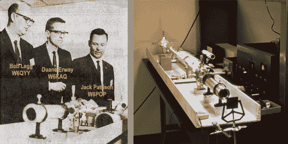

# 50 年前建造的第一台激光发射器

> 原文：<https://hackaday.com/2013/05/14/retrotechtacular-first-laser-transmitter-built-50-years-ago/>

大多数时候，我们在我们的“复古技术”系列中以做作的电影镜头为特色，但我们认为这种技术今天和 50 年前一样酷。[Clint]写信告诉我们关于[红线行动](http://modulatedlight.org/eos/Operation_Red_Line.html)的情况。这是 1963 年 5 月 3 日和 4 日进行的一项实验，这意味着 50 周年纪念日刚刚在几周前过去。黑客利用激光远距离发送数据(这里是音频)。但那时候你不能跳到易贝身上订购零件。这个团队不得不为自己拼凑所有的东西。

他们建造了自己的氦氖激光管，如右图所示。参与其中的先生们白天是一家名为电光系统(EOS)的公司的工程师，晚上是业余无线电爱好者。在雇主的支持下，他们能够利用工作中的玻璃吹制和光学资源来发挥自己的爱好技能，让激光器运转起来。这方面的事情处理好后，他们转向接收端。使用望远镜和光电倍增器，他们能够在大约 119 英里的距离捕捉到光束。他们成就的顶峰是在发射机上调制音频，并用接收机解调。

[Clint]认识做这件事的人，并在他自己的博客上写下了对这个项目的回顾。